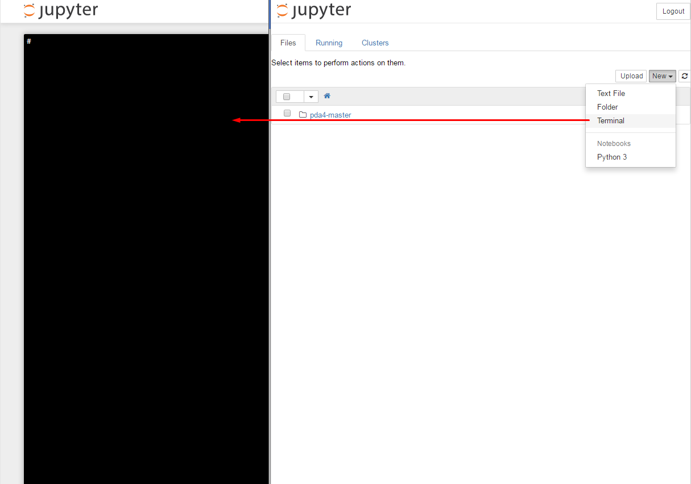

### Anaconda 업데이트 관련 가이드.

수업 끝부분에 강사님이 말슴하셨던 conda update관련 내용 가이드 입니다.

1. jupyter notebook 내의 터미널을 엽니다. ( jupyter notebook 내의 터미널을 사용하시기 바랍니다. jupyter notebook 이 돌아가고 있는 container 내에서 업데이트 하셔야 합니다. 해당 터미널은 docker machine의 터미널이 아닙니다.       이후로는 계속해서 터미널상에서 실행하시면 됩니다.   
2. "conda update conda"를 실행 합니다.     
3. "conda install numexpr"를 실행 합니다.     
4. "pip install pandas_datareader"를 실행합니다.  **강의 예제중 pandas_datareader 를 불러오지 못하신분들은 설치해주시기 바랍니다.** 
5. 매니저님이 댓글 달아주신 부분 "conda update pandas" 실행

수정 완료.(2016/6/20 17:25KST)
끝.
